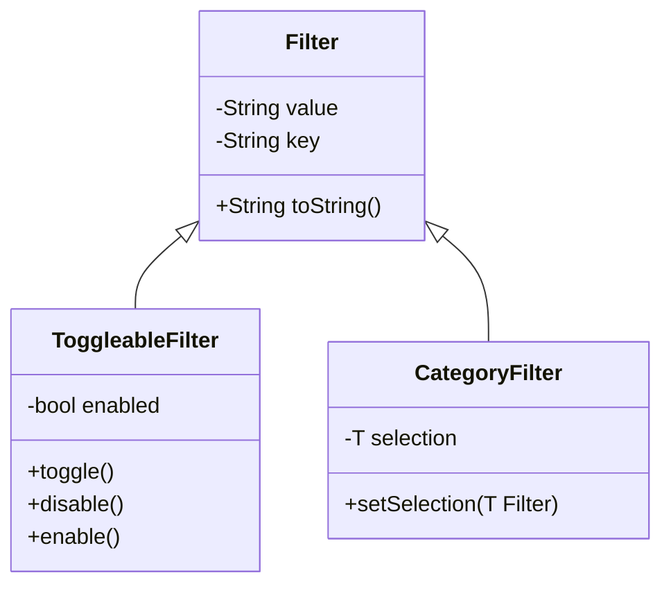

# Copyright-Public-Records-API
New: In progress Java API for scraping the copyright office public records

(For planning)

```mermaid
classDiagram
      Filter <|--	ToggleableFilter
      Filter <|--	CategoryFilter
      
      class Filter {
        -String value
        -String key                    
        +String toString()                
      }
      class ToggleableFilter {
        -bool enabled
   
        +toggle()
        +disable()
        +enable()
      }
      class CategoryFilter~T~ {
        -T selection
        
        +setSelection(T Filter)
      }
     
```
