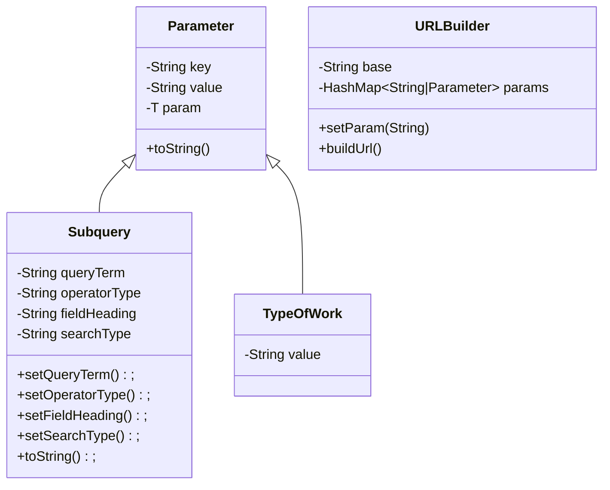

# Copyright-Public-Records-API
New: In progress JS  API for scraping the copyright office public records

(For planning)


```java
enum ParamLabels {
      RECORDS_PER_PAGE,
      SUBQUERY,
      TYPE_OF_WORK,
      REGISTRATION_STATUS,
      REGISTRATION_CLASS,
      REGISTRATION_ITEM_TYPES,
      TYPE_OF_DOCUMENT,
      PAGE_NUMBER,
      DATE_FIELD,
      START_DATE,
      END_DATE,
      SORT_FIELD,
      SORT_ORDER
      
}

if (registration_class || registration_class || registration_item_types) {
      // if both recordation and registration filters are present just default to all records
      if (type_of_document) {
            // remove all type_of_work
            addParam(type_of_work, "all records")
      }
      
      addParam("type_of_work", "registration");
}
else if (type_of_document) 
      addParam(type_of_work", recordation")
      
if (date_field != "representative_date" && (!start_date || !endDate)) {
      date_field = "representative_date"
}


```

URL BREAKDOWN
```
base:
      https://publicrecords.copyright.gov/advanced-search?
            records_per_page {int}
            
            subquery {
                  "queryTerm":"",
                  "operatorType:"",
                  "fieldHeading":"Keyword",
                  "searchType":"As a Phrase",
                  "searchTypeReverseLookup":{"exact":"Is (exact)","starts_with":"Starts with","contains":"Contains","phrase":"As a Phrase"}
            }
           
           type_of_work { "all records" "registration" "recordation"} 
                        <--OPTIONAL-->
                  if type_of_work = registration
                        registration_status = { "published" "unpublished" "unspecified" }
                        registration_class = {TODO}
                        registration_item_types = {TODO}
                  
                  if type_of_work = recordation 
                        type_of_document = {TODO};
            
            page_number {int}
            
            date_field { "representative_date" "registration_date_as_date" "creation_date_as_year" "recordation_date_as_date" "execution_date_statement_as_date"}
                  if date_field != representative_date -> start_date && end_date are required
                  
                        start_date { Thu May 13 2004 00:00:00 GMT-0400 (Eastern Daylight Time) }
                        start_date { Thu May 13 2004 00:00:00 GMT-0400 (Eastern Daylight Time) }

             
            sort_field { "representative_date" "full_title" }
                  sort_order { "asc" "desc" }
            
            
```

standards:
```
title: textarea[name="s_1_1_8_0"][aria-labelledby="Title_Label"]
year_of_completion: input[name="s_7_44_0"][aria-labelledby="Year_of__Completion_Label"]
date_of_first_publication: input[name="s_7_1_42_0"][aria-labelledby="Publication_Date_Label"]
internal_tracking_number: input[name="s_3_1_4_0"][aria-labelledby="InternalTrackingNumber_Label"]


