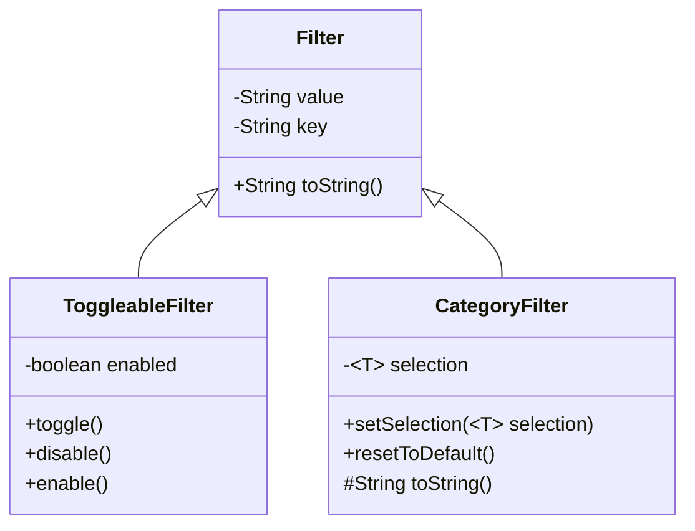

# Copyright-Public-Records-API
New: In progress Java API for scraping the copyright office public records

(For planning)


URL BREAKDOWN
```
base:
      https://publicrecords.copyright.gov/advanced-search?
            records_per_page=10&
            subquery={
                  "queryTerm":"",
                  "fieldHeading":"Keyword",
                  "searchType":"As a Phrase",
                  "searchTypeReverseLookup":{"exact":"Is (exact)","starts_with":"Starts with","contains":"Contains","phrase":"As a Phrase"}
            }
            type_of_work
            page_number
            date_field
            sort_field
            sort_order 
            start_date
            end_date
            
            // REGISTRATION FILTERS
            registration_status
            registstration_class
            registration_item_types

            // RECORDATION FILTERS
            type_of_document 
```
